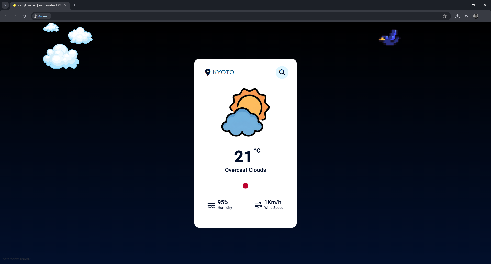

# CozyForecast 🌦️

**Interactive weather data visualization powered by the OpenWeather API.**

CozyForecast is a lightweight web application that retrieves, processes and visualizes real-time weather data through the OpenWeather API, providing a clean and intuitive interface for exploring meteorological information.

---

## Features

- Real-time weather data retrieval
- City-based search
- Dynamic weather visualization
- Country identification with flags
- Weather icons based on API conditions
- Responsive interface
- Keyboard support (Enter to search)
- Error handling for invalid locations

---

## Data Workflow

```text
User Input
     │
     ▼
OpenWeather API
     │
     ▼
JSON Response
     │
     ▼
Data Processing
     │
     ▼
Dynamic UI Rendering
```

---

## Technical Highlights

- REST API integration using Fetch API
- JSON parsing and data processing
- Dynamic DOM manipulation
- Conditional rendering
- Native internationalization (`Intl.DisplayNames`)
- Error handling based on API responses
- UI animations with `requestAnimationFrame`

---

## Tech Stack

### Languages

- HTML5
- CSS3
- JavaScript (Vanilla)

### Data & APIs

- OpenWeather API
- REST API
- JSON

### Concepts

- Data Visualization
- API Integration
- Asynchronous Programming
- Client-side Rendering

---

## Preview

<p align="center">
  
</p>

---

## Project Goals

- Consume data from a public REST API
- Process JSON responses
- Transform weather data into an intuitive visualization
- Practice asynchronous JavaScript
- Build interactive interfaces without frameworks

---

## Getting Started

```bash
git clone https://github.com/petersonwilliam97/CozyForecast.git

cd CozyForecast
```

Open `index.html` in your browser.

---

## Future Improvements

- Hourly and weekly forecasts
- Temperature charts
- Weather history
- Multiple location comparison
- Additional weather metrics
- Improved accessibility

---

## License

This project is available under the MIT License.
